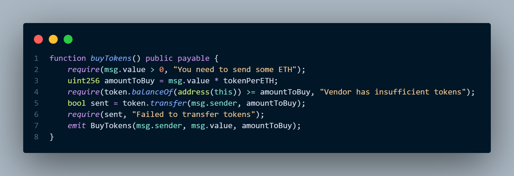

<div align="center">
  
</div>

<h1 align="center"><b>JAY Protocol ‐ Core Contracts</b></h1>

<div align="center">
   &nbsp;
   &nbsp;
   &nbsp;
  
</div>

<br />

<div align="center">
  
</div>

---

## Overview

The **JAY Protocol** is a minimal, single‑asset DeFi ecosystem built around a fixed‑supply ERC‑20 token (`JayToken`) and a paired **Vendor** contract that provides on‑chain buy/sell functionality at a constant rate.  
Designed for institutional‑grade liquidity without order books, the protocol enables:

- **Zero‑fee, fixed‑rate swaps** between ETH and JAY.
- A simple “cash‑register” model where the vendor always maintains a token balance and ETH reserve.
- Owner‑controlled profit extraction and unsold token recovery.

The contracts are written in Solidity 0.8.x and leverage OpenZeppelin’s battle‑tested libraries. Deployment is managed via Hardhat Ignition; tests use the Hardhat network and Ethers‑js.

---

## Core Architecture

- `contracts/JayToken.sol`

  - Extends [`ERC20`](https://github.com/OpenZeppelin/openzeppelin-contracts/blob/master/contracts/token/ERC20/ERC20.sol) from OpenZeppelin.
  - mints **1 000 000 JAY** (18 decimals) to the deployer on construction.
  - No owner‑only privileges or pausing – pure, immutable token policy.

- `contracts/Vendor.sol`

  - `tokenPerETH` fixed at **500** JAY per ETH.
  - **buyTokens()**
    - `payable` entry point.
    - `require(msg.value > 0)` and sufficient vendor token balance.
    - Transfers tokens directly (`token.transfer`).
    - Emits `BuyTokens` event.
  - **sellTokens(uint256)**
    - Checks user balance and vendor ETH reserve.
    - Uses `token.transferFrom` (user must approve first).
    - Sends ETH with low‑level `call` and checks return value.
    - Emits `SellTokens` event.
  - **withdrawETH() / withdrawTokens()**
    - `onlyOwner` modifier guards; owner set in constructor.
    - Allows profit withdrawal and recovery of unsold tokens.
  - Access control via `onlyOwner` modifier.
  - Comprehensive `require` guards prevent reverts and bad state.

- Deployment (see `ignition/modules/Deploy.js` & `JayProject.js`)
  - Ignition module automatically deploys `JayToken` and `Vendor`.
  - After deployment transfers **500 000 JAY** (×10¹⁸) to the vendor as inventory.

---

## Local Development

1. **Clone & install dependencies**

   ```sh
   git clone <repo-url>
   cd jay-token-contracts
   npm install
   ```

2. **Compile**

   ```sh
   npx hardhat compile
   ```

3. **Run the test suite**

   ```sh
   npx hardhat test
   # with gas report
   REPORT_GAS=true npx hardhat test
   ```

   Tests are located in [`test/JayToken.js`](test/JayToken.js) and cover the core buy‑flow, including:

   - ERC‑20 transfer of initial supply.
   - Buying tokens with 1 ETH → 500 JAY.
   - Balance assertions via Chai `expect`.

4. **Run a local node**

   ```sh
   npx hardhat node
   ```

   Use the generated accounts in scripts or the console.

---

## Deployment & Verification

### Configuration

The project uses `hardhat.config.js`:

```js
solidity: "0.8.20",
networks: {
  localhost: { url: "[http://127.0.0.1:8545](http://127.0.0.1:8545)" },
  sepolia: {
    url: process.env.INFURA_RPC_URL || "",
    accounts: process.env.PRIVATE_KEY ? [process.env.PRIVATE_KEY] : []
  }
},
etherscan: { apiKey: process.env.ETHERSCAN_API_KEY }
```

Set the following environment variables in a `.env` file:

```
INFURA_RPC_URL=…
PRIVATE_KEY=0x…
ETHERSCAN_API_KEY=…
```

### Deploying

Using Hardhat Ignition (recommended for deterministic deployments):

```sh
npx hardhat ignition deploy ./ignition/modules/Deploy.js --network sepolia
```

or, if you use the alternative module:

```sh
npx hardhat ignition deploy ./ignition/modules/JayProject.js --network sepolia
```

The output will include the deployed addresses for both contracts.

> – you can also write ad‑hoc scripts using `ethers.getContractFactory` if preferred.

### Verifying on Etherscan

```sh
npx hardhat verify --network sepolia <JayToken_address>
 npx hardhat verify --network sepolia <Vendor_address> <JayToken_address>
```

Example address table (replace with actual values):

| Contract | Sepolia Address                              | Notes             |
| -------- | -------------------------------------------- | ----------------- |
| JayToken | `0xd8A13966F86d917f0D3892f68BDf729655E9544a` | ERC‑20 token      |
| Vendor   | `0xA23E3136523281be93e85FBd9EB9B6d282C1A913` | Swap/market maker |

---

## Security & Auditing

The test suite exercises the core economic flows; additional coverage may be added for:

- Selling tokens (requires `approve`).
- Owner withdrawal edge cases.
- Handling of zero/overflow values (Solidity 0.8 handles safe math).

Contracts depend on OpenZeppelin’s audited libraries and employ explicit `require` statements for all user inputs and state changes.  
Deployment via Ignition provides reproducible bytecode.  
A formal audit should review:

- Reentrancy (use of `call` to send ETH).
- Pricing logic and rounding behaviour.
- Access control (onlyOwner) and constructor initialization.

---

This repository constitutes the **formal smart‑contract core** of the JAY Protocol. It is intended for use as a foundation for wallets, front‑ends, and further DeFi extensions. All commands above assume a Unix‑style shell; adjust accordingly for Windows.

---

## 👨‍💻 Author

Developed by **Zaidan**.  
I am an active Information Technology student at Institut Teknologi Indonesia (ITI) with a solid foundation in programming, system administration, and general IT problem-solving. I am currently looking for part-time opportunities to apply my technical skills.

- **GitHub:** [@MuhammadZaidan1](https://github.com/MuhammadZaidan1)
- **LinkedIn:** [muhammad zaidan](https://www.linkedin.com/in/muhammad-zaidan-046872336/)
- **Email:** muhammadzaidanf123@gmail.com